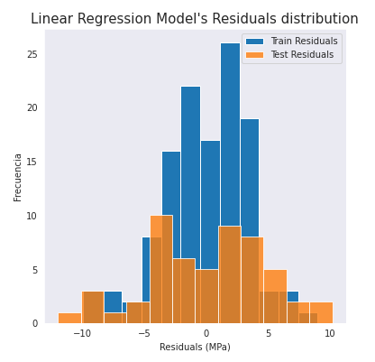
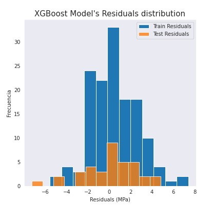

# Rebound test web app

In this repository I made a web app to estimate concrete strength using the results of the rebound test and some aditional information with the help of a machine learning model. You will be able to find all the previous research in this [repository](https://github.com/mbbau/About-rebound-test-and-its-models-of-prediction).

You can find the app in the next [link](https://mbbau-rebound-test-web-app-rebound-streamlit-t2l6c9.streamlit.app/).

The main goal of this work was to reduce the error when trying to estimate concrete strength. As can be seeing in the next figures, the distributions of residuals for both models show that the performance was improved.

